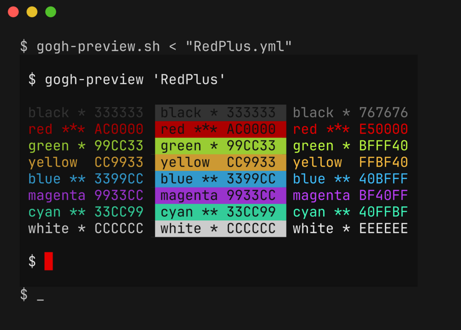

# gogh-preview

Script to preview themes from [Gogh](https://github.com/Gogh-Co/Gogh) in your terminal.

Example usage:

```bash
# single file
gogh-preview.sh <'Adventure Time.yml'

# browse and filter with preview
ls *.yml | fzf --preview='yq {} | gogh-preview.sh'
```


